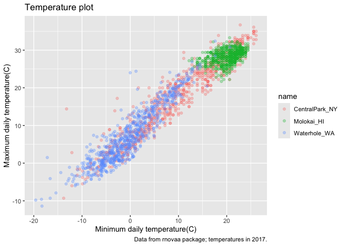
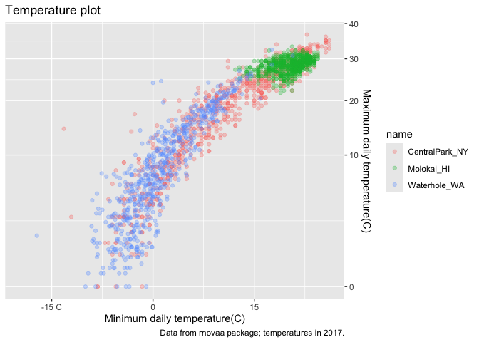
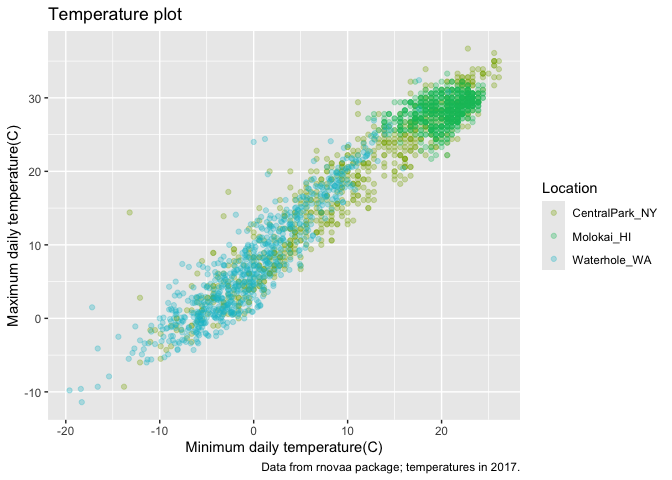
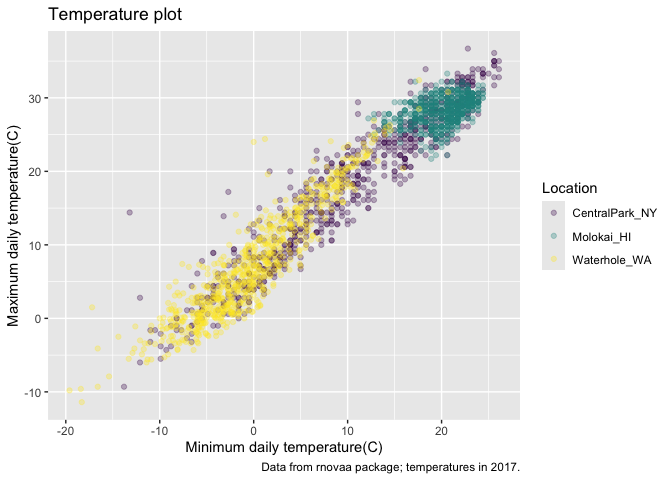

vis_ii
================
ww2745
2024-10-13

``` r
library(tidyverse)
```

    ## ── Attaching core tidyverse packages ──────────────────────── tidyverse 2.0.0 ──
    ## ✔ dplyr     1.1.4     ✔ readr     2.1.5
    ## ✔ forcats   1.0.0     ✔ stringr   1.5.1
    ## ✔ ggplot2   3.5.1     ✔ tibble    3.2.1
    ## ✔ lubridate 1.9.3     ✔ tidyr     1.3.1
    ## ✔ purrr     1.0.2     
    ## ── Conflicts ────────────────────────────────────────── tidyverse_conflicts() ──
    ## ✖ dplyr::filter() masks stats::filter()
    ## ✖ dplyr::lag()    masks stats::lag()
    ## ℹ Use the conflicted package (<http://conflicted.r-lib.org/>) to force all conflicts to become errors

``` r
library(patchwork)
```

``` r
weather_df = 
  read_csv("./data/weather_df.csv")
```

    ## Rows: 2190 Columns: 6
    ## ── Column specification ────────────────────────────────────────────────────────
    ## Delimiter: ","
    ## chr  (2): name, id
    ## dbl  (3): prcp, tmax, tmin
    ## date (1): date
    ## 
    ## ℹ Use `spec()` to retrieve the full column specification for this data.
    ## ℹ Specify the column types or set `show_col_types = FALSE` to quiet this message.

``` r
weather_df
```

    ## # A tibble: 2,190 × 6
    ##    name           id          date        prcp  tmax  tmin
    ##    <chr>          <chr>       <date>     <dbl> <dbl> <dbl>
    ##  1 CentralPark_NY USW00094728 2021-01-01   157   4.4   0.6
    ##  2 CentralPark_NY USW00094728 2021-01-02    13  10.6   2.2
    ##  3 CentralPark_NY USW00094728 2021-01-03    56   3.3   1.1
    ##  4 CentralPark_NY USW00094728 2021-01-04     5   6.1   1.7
    ##  5 CentralPark_NY USW00094728 2021-01-05     0   5.6   2.2
    ##  6 CentralPark_NY USW00094728 2021-01-06     0   5     1.1
    ##  7 CentralPark_NY USW00094728 2021-01-07     0   5    -1  
    ##  8 CentralPark_NY USW00094728 2021-01-08     0   2.8  -2.7
    ##  9 CentralPark_NY USW00094728 2021-01-09     0   2.8  -4.3
    ## 10 CentralPark_NY USW00094728 2021-01-10     0   5    -1.6
    ## # ℹ 2,180 more rows

## Remember this plot?

``` r
weather_df |> 
  ggplot(aes(x=tmin,y=tmax,color=name))+
  geom_point(alpha=.3)
```

    ## Warning: Removed 17 rows containing missing values or values outside the scale range
    ## (`geom_point()`).

<!-- -->

\##labs

``` r
weather_df |> 
  ggplot(aes(x=tmin,y=tmax,color=name))+
  geom_point(alpha=.3)+
  labs(
    title="Temperature plot",
    x="Minimum daily temperature(C)",
    y="Maximum daily temperature(C)",
    caption="Data from rnovaa package; temperatures in 2017."
  )
```

    ## Warning: Removed 17 rows containing missing values or values outside the scale range
    ## (`geom_point()`).

<!-- -->

\##Scales

``` r
weather_df |> 
  ggplot(aes(x=tmin,y=tmax,color=name))+
  geom_point(alpha=.3)+
  labs(
    title="Temperature plot",
    x="Minimum daily temperature(C)",
    y="Maximum daily temperature(C)",
    caption="Data from rnovaa package; temperatures in 2017."
  )+
  scale_x_continuous(
    breaks=c(-15,0,15),
    labels=c("-15 C","0","15")
  )+
  scale_y_continuous(
    trans="sqrt",  #also could do "log" transformation
    position="right"
  )
```

    ## Warning in transformation$transform(x): NaNs produced

    ## Warning in scale_y_continuous(trans = "sqrt", position = "right"): sqrt
    ## transformation introduced infinite values.

    ## Warning: Removed 142 rows containing missing values or values outside the scale range
    ## (`geom_point()`).

<!-- -->

let’s look at color scales

``` r
weather_df |> 
  ggplot(aes(x=tmin,y=tmax,color=name))+
  geom_point(alpha=.3)+
  labs(
    title="Temperature plot",
    x="Minimum daily temperature(C)",
    y="Maximum daily temperature(C)",
    caption="Data from rnovaa package; temperatures in 2017."
  )+
  scale_color_hue(
    name="Location", #change label name
    h=c(100,200))
```

    ## Warning: Removed 17 rows containing missing values or values outside the scale range
    ## (`geom_point()`).

<!-- --> use default
color: recommended

``` r
weather_df |> 
  ggplot(aes(x=tmin,y=tmax,color=name))+
  geom_point(alpha=.3)+
  labs(
    title="Temperature plot",
    x="Minimum daily temperature(C)",
    y="Maximum daily temperature(C)",
    caption="Data from rnovaa package; temperatures in 2017."
  )+
  viridis::scale_color_viridis(
    name="Location",
    discrete=TRUE
  ) #default is continuous
```

    ## Warning: Removed 17 rows containing missing values or values outside the scale range
    ## (`geom_point()`).

<!-- -->
